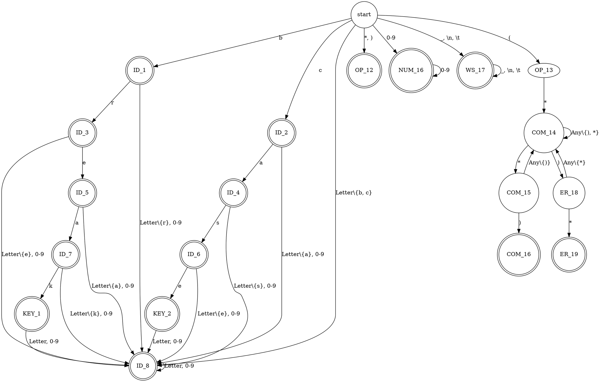
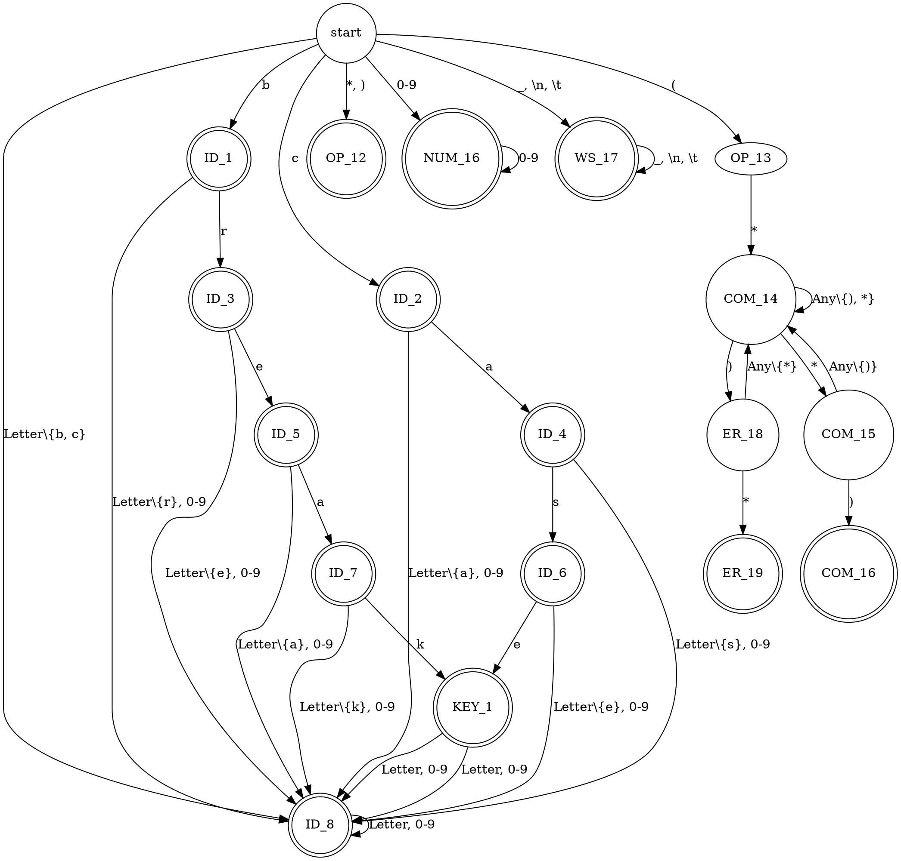

% Лабораторная работа № 1.4 «Лексический распознаватель»
% 29 марта 2023 г.
% Головкин Дмитрий, ИУ9-62Б

# Цель работы
Целью данной работы является изучение использования детерминированных конечных автоматов с размеченными
заключительными состояниями (лексических распознавателей) для решения задачи лексического анализа.

# Индивидуальный вариант
case, break, *, (, ), комментарии ограничены знаками (*, *) могут пересекать границы строк текста.

# Реализация

Граф недетерминированного распознавателя:



Граф детерминированного распознавателя:



Реализация распознавателя:

```python
from enum import Enum, auto
from copy import deepcopy, copy

class DomainTag(Enum):
    Start = auto()    # 1
    Whitespace = auto()    # 2
    Ident1 = auto()    # 3
    Ident2 = auto()    # 4
    Ident3 = auto()    # 5
    Ident4 = auto()    # 6
    Ident5 = auto()    # 7
    Ident6 = auto()    # 8
    Ident7 = auto()    # 9
    Ident8 = auto()    # 10
    Keyword1 = auto()    # 11
    Keyword2 = auto()    # 12
    Num_liter = auto()    # 13
    Operation1 = auto()    # 14
    Operation = auto()    # 15
    Comment = auto()    # 16
    Error_Comment = auto()    # 17
    Right_Comment = auto()    # 18
    Error = auto()    # 19
    Commentary = auto()    # 20
    Unknown = auto()    # 21
    EndOfProgramm = auto()    # 22

class ErrorMessage():

    def __init__(self, is_error = None, text = None, position = None):
        self.is_error = is_error
        self.text = text
        self.position = position

    def __repr__(self):
        return f"{self.text} + {self.position}"
    

class Fragment():

    def __init__(self, starting, following):
        self.starting = starting
        self.following = following
    
    def __repr__(self):
        return f"{self.starting} - {self.following}"
        

class Position:

    def __init__(self, text):
        self.text = text
        self.line = 1
        self.pos = 1
        self.index = 0
    
    def get_line(self):
        return self.line
    
    def get_pos(self):
        return self.pos
    
    def get_index(self):
        return self.index
    
    def get_code(self):
        return self.text[self.index]
    
    def cur_position(self):
        return (-1 if self.index == len(self.text) else self.text[self.index])
    
    def compare_to(self, other_pos):
        return (self.get_index() == other_pos.get_index())
    
    def is_white_space(self):
        return ((self.get_index() != len(self.text)) and \
                self.text[self.get_index()].isspace())
    
    def is_letter(self):
        return ((self.get_index() != len(self.text)) and \
                self.text[self.get_index()].isalpha())
    
    def is_decimal_digit(self):
        return ((self.get_index() != len(self.text)) and \
                self.text[self.get_index()] <= '9' and \
                self.text[self.get_index()] >= '0' )
    
    def is_letter_or_digit(self):
        pass

    def is_new_line(self):
        return self.text[self.get_index()] == '\n'

    def next(self):
        if self.index < len(self.text):
            if self.is_new_line():
                if self.text[self.get_index()] == '\r':
                    self.index += 1
                self.line += 1
                self.pos = 1
            else:
                self.pos += 1
            self.index += 1

    def number_column(self, symbols):
        #print(self.get_code(), '0000000000')
        if self.cur_position() == -1:
            return -1
        elif self.is_white_space():
            return 9
        elif self.get_code() in symbols:
            #print(self.get_code(), '0000000000')
            return symbols[self.get_code()]
        elif self.get_code().isalpha():
            return 7
        elif self.get_code().isdigit():
            return 8
        else:
            return 10

    def __repr__(self):
        return "{},{}".format(self.line, self.pos)
    

class Token:

    def __init__(self, tag, coords, value = None):
        self.tag = tag
        self.coords = coords
        self.value = value

    def __repr__(self):
        return f"{self.tag} ({self.coords.starting} - {self.coords.following}) : {self.value}"
    

class Lex_matcher:

    def __init__(self, text_program = None):
        self.text_program = text_program
        self.final_state = {DomainTag.Whitespace, DomainTag.Keyword1, DomainTag.Commentary, \
                            DomainTag.Num_liter, \
                            DomainTag.Error, DomainTag.Operation, DomainTag.Operation1, \
                            DomainTag.Ident8, \
                            DomainTag.Keyword2, DomainTag.Ident7, DomainTag.Ident6, DomainTag.Ident5, \
                            DomainTag.Ident4, \
                            DomainTag.Ident3, DomainTag.Ident2, DomainTag.Ident1}
        self.symbols = {'c' : 0, 'a' : 1,'s' : 2, 'e' : 3,'b' : 4, 'r' : 5,'k' : 6, ')' : 11,  \
                        '(' : 12, '*' : 13}
        self.table = [
                    #  c,  a,  s,  e,  b,  r,  k, Lt, Di, Ws, X,   ),  (,  *
                     [ 4, 10, 10, 10,  3, 10, 10, 10, 13,  2, 21, 15, 14, 15],    # 1
                     [-1, -1, -1, -1, -1, -1, -1, -1, -1,  2, 21, -1, -1, -1],    # 2
                     [10, 10, 10, 10, 10,  5, 10, 10, 10, -1, 21, -1, -1, -1],    # 3    
                     [ 6, 10, 10, 10, 10, 10, 10, 10, 10, -1, 21, -1, -1, -1],    # 4
                     [10, 10, 10,  7, 10, 10, 10, 10, 10, -1, 21, -1, -1, -1],    # 5
                     [10, 10,  8, 10, 10, 10, 10, 10, 10, -1, 21, -1, -1, -1],    # 6
                     [10,  9, 10, 10, 10, 10, 10, 10, 10, -1, 21, -1, -1, -1],    # 7
                     [10, 10, 10, 12, 10, 10, 10, 10, 10, -1, 21, -1, -1, -1],    # 8
                     [10, 10, 10, 10, 10, 10, 11, 10, 10, -1, 21, -1, -1, -1],    # 9
                     [10, 10, 10, 10, 10, 10, 10, 10, 10, -1, 21, -1, -1, -1],    # 10
                     [10, 10, 10, 10, 10, 10, 10, 10, 10, -1, 21, -1, -1, -1],    # 11    
                     [10, 10, 10, 10, 10, 10, 10, 10, 10, -1, 21, -1, -1, -1],    # 12
                     [-1, -1, -1, -1, -1, -1, -1, -1, 13, -1, 21, -1, -1, -1],    # 13
                     [-1, -1, -1, -1, -1, -1, -1, -1, -1, -1, 21, -1, -1, 16],    # 14
                     [-1, -1, -1, -1, -1, -1, -1, -1, -1, -1, 21, -1, -1, -1],    # 15
                     [16, 16, 16, 16, 16, 16, 16, 16, 16, 16, 16, 17, 16, 18],    # 16
                     [16, 16, 16, 16, 16, 16, 16, 16, 16, 16, 16, 16, 16, 19],    # 17
                     [16, 16, 16, 16, 16, 16, 16, 16, 16, 16, 16, 20, 16, 16],    # 18
                     [-1, -1, -1, -1, -1, -1, -1, -1, -1, -1, 21, -1, -1, -1],    # 19
                     [-1, -1, -1, -1, -1, -1, -1, -1, -1, -1, 21, -1, -1, -1],    # 20
                     [-1, -1, -1, -1, -1, -1, -1, -1, -1, -1, 21, -1, -1, -1]    # 21
                      ]
        self.cur = Position(text_program)
        
    def get_token(self):
        while self.cur.cur_position() != -1:
            while self.cur.is_white_space():
                self.cur.next()
            state = 0
            prev_state = 0
            start = deepcopy(self.cur)
            while state != -1:
                symbol = self.cur.number_column(self.symbols)
                prev_state = state
                if symbol == -1:
                    state = -1
                else:
                    #print(state, symbol, '+++++++++++++++')
                    if state > 0:
                        state -= 1
                    state = self.table[state][symbol]
                    self.cur.next()
            #print(prev_state, '______')
            if prev_state != 2 and prev_state != 1 and prev_state != 21:
                end = deepcopy(self.cur)
                if prev_state == 19:
                    return Token(DomainTag.Error, Fragment(start, end), 1)
                elif DomainTag(prev_state) not in self.final_state and \
                    DomainTag(prev_state) == DomainTag.Operation1:
                    return Token(DomainTag.Error, Fragment(start, end), 2)
                elif DomainTag(prev_state) not in self.final_state and \
                    DomainTag(prev_state) == DomainTag.Comment:
                    return Token(DomainTag.Error, Fragment(start, end), 3)
                elif DomainTag(prev_state) not in self.final_state:
                    return Token(DomainTag.Error, Fragment(start, end), 4)
                else:
                    #print(self.text_program[start.get_index():])
                    return Token(DomainTag(prev_state), Fragment(start, end), \
                         self.text_program[start.get_index():end.get_index()])
            else:
                while self.cur.cur_position() != -1 and self.cur.number_column(self.symbols) == -1:
                    self.cur.next()
                end = deepcopy(self.cur)
                return Token(DomainTag.Error, Fragment(start, end), 5)    
        return Token(DomainTag.EndOfProgramm, Fragment(self.cur, self.cur))       

    def create_tokens_list(self):
        token_list = []
        token = self.get_token()
        while token.tag != DomainTag.EndOfProgramm:
            token_list.append(token)
            token = self.get_token()
        token_list.append(token)
        return token_list
    

def main():
    f =  open('laba1.4/file.txt')
    an_str = f.read()
    scanner = Lex_matcher(an_str)
    token_list = scanner.create_tokens_list()
    for token in token_list:
        print(token)

if __name__ == '__main__':
    main()

```

# Тестирование

Входные данные

```
( a1 a2 * 11 ) (*
test *)
```

Вывод на `stdout`

```
…
```

# Вывод
Был построен детерминированный конечный автомат с размеченными заключительными состояниями
и на его основе реализован лексический распознаватель на языке python.